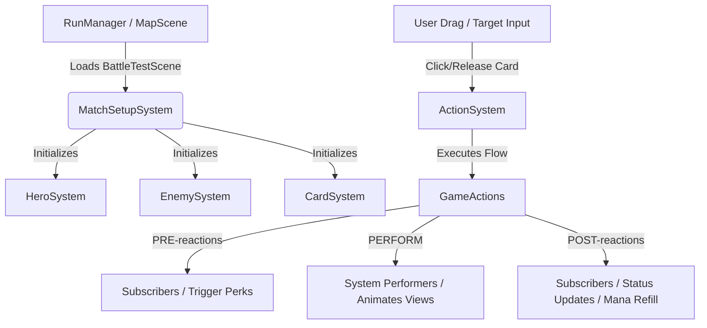

# Project-D: Developer Documentation & System Architecture

Welcome to the **Project-D** developer documentation! This README covers the architecture, existing features, guides on adding content (cards, perks, enemies, and stages), identified bugs, and future roadmap.

---

## Table of Contents
1. [System Architecture](#system-architecture)
2. [Action-Reaction Framework](#action-reaction-framework)
3. [Existing Features & Systems](#existing-features--systems)
4. [Guides: Adding New Content](#guides-adding-new-content)
    - [How to Make New Cards](#how-to-make-new-cards)
    - [How to Make New Perks](#how-to-make-new-perks)
    - [How to Make New Enemies](#how-to-make-new-enemies)
    - [How to Make New Stages](#how-to-make-new-stages)
5. [Identified Bugs & Errors](#identified-bugs--errors)
6. [Future Implementation & Roadmap](#future-implementation--roadmap)

---

## System Architecture

Project-D consists of two main gameplay subsystems:
1. **The Campaign Map System** (Overworld): Located in `Assets/Scripts/`, handles procedural map node generation, user path traversal, currency management, and loading combat encounters.
2. **The Battle Combat System**: Located in `Assets/Battle Assets/`, built around a decoupled **Model-View-System** paradigm driven by a custom **Action-Reaction (Command-like)** pattern.



### Decoupled Model-View-System
* **Models**: Contain the state and settings, usually initialized from Unity `ScriptableObject` configurations.
  * [Card](file:///c:/Users/marco/Project-D/Assets/Battle%20Assets/Battle_scripts/Models/Card.cs), [Perk](file:///c:/Users/marco/Project-D/Assets/Battle%20Assets/Battle_scripts/Models/Perk.cs), [PerkCondition](file:///c:/Users/marco/Project-D/Assets/Battle%20Assets/Battle_scripts/Models/PerkCondition.cs), [TargetMode](file:///c:/Users/marco/Project-D/Assets/Battle%20Assets/Battle_scripts/Models/TargetMode.cs)
* **Views**: Handle visuals, animations, and input, but also track local instance variables like health.
  * [CardView](file:///c:/Users/marco/Project-D/Assets/Battle%20Assets/Battle_scripts/Views/CardView.cs), [CombatantView](file:///c:/Users/marco/Project-D/Assets/Battle%20Assets/Battle_scripts/Views/CombatantView.cs), [EnemyView](file:///c:/Users/marco/Project-D/Assets/Battle%20Assets/Battle_scripts/Views/EnemyView.cs), [HeroView](file:///c:/Users/marco/Project-D/Assets/Battle%20Assets/Battle_scripts/Views/HeroView.cs)
* **Systems**: Hold the performers that execute gameplay logic.
  * [CardSystem](file:///c:/Users/marco/Project-D/Assets/Battle%20Assets/Battle_scripts/Systems/CardSystem.cs), [ManaSystem](file:///c:/Users/marco/Project-D/Assets/Battle%20Assets/Battle_scripts/Systems/ManaSystem.cs), [EnemySystem](file:///c:/Users/marco/Project-D/Assets/Battle%20Assets/Battle_scripts/Systems/EnemySystem.cs), [PerkSystem](file:///c:/Users/marco/Project-D/Assets/Battle%20Assets/Battle_scripts/Systems/PerkSystem.cs), [StatusEffectSystem](file:///c:/Users/marco/Project-D/Assets/Battle%20Assets/Battle_scripts/Systems/StatusEffectSystem.cs), [DamageSystem](file:///c:/Users/marco/Project-D/Assets/Battle%20Assets/Battle_scripts/Systems/DamageSystem.cs), [BurnSystem](file:///c:/Users/marco/Project-D/Assets/Battle%20Assets/Battle_scripts/Systems/BurnSystem.cs)

---

## Action-Reaction Framework

The battle loop runs entirely through the [ActionSystem](file:///c:/Users/marco/Project-D/Assets/Battle%20Assets/Battle_scripts/General/ActionReaction/ActionSystem.cs). 
A `GameAction` is a data packet carrying targets, amount, or source information. It does not execute logic itself. Instead, it transitions through three phases:

1. **PRE Phase**:
   - Triggers all listeners registered with `ActionSystem.SubscribeReaction<T>(..., ReactionTiming.PRE)`.
   - Appends any generated reactions to the `PreReactions` queue.
2. **PERFORM Phase**:
   - Calls the registered **Performer** coroutine attached to that action type (e.g. subtracting mana, moving the enemy view, dealing damage, showing VFX).
3. **POST Phase**:
   - Triggers all listeners registered with `ActionSystem.SubscribeReaction<T>(..., ReactionTiming.POST)`.
   - Appends any generated reactions to the `PostReactions` queue.

### Example Flow: Player plays a card with 3 Mana Cost
```
1. PlayCardGA is created and sent to ActionSystem.
2. Performers and subscribers are fetched.
3. [PERFORM] CardSystem.PlayCardPerformer runs:
   - Removes card from hand, plays discard animations.
   - Adds SpendManaGA reaction to queue.
   - Evaluates card targets and queues PerformEffectGA.
4. SpendManaGA is executed:
   - SpendManaPerformer subtracts 3 Mana and updates ManaUI.
5. PerformEffectGA is executed:
   - Evaluates targets and executes the DealDamageGA action.
6. DealDamageGA is executed:
   - DealDamagePerformer damages the targets, plays hit VFX, checks if targets died (if so, queues KillEnemyGA).
```

---

## Existing Features & Systems

### 1. Card Management & Playing
* Players draw, discard, and play cards.
* Supports **manual target selection** (drag arrow indicator from card to enemy collider) and **automatic targeting** (hits all enemies, random targets, self, etc.).
* Implemented in [CardSystem](file:///c:/Users/marco/Project-D/Assets/Battle%20Assets/Battle_scripts/Systems/CardSystem.cs) & [CardView](file:///c:/Users/marco/Project-D/Assets/Battle%20Assets/Battle_scripts/Views/CardView.cs).

### 2. Mana System
* Player has a maximum mana of 3. Playing cards consumes mana. Mana is refilled at the end of the enemy turn.
* Implemented in [ManaSystem](file:///c:/Users/marco/Project-D/Assets/Battle%20Assets/Battle_scripts/Systems/ManaSystem.cs).

### 3. Combatant Health & Armor
* Combatants (Hero & Enemies) have HP. Damage is absorbed by the `ARMOR` status effect first.
* Implemented in [CombatantView](file:///c:/Users/marco/Project-D/Assets/Battle%20Assets/Battle_scripts/Views/CombatantView.cs).

### 4. Status Effects
* **ARMOR**: Absorbs damage stack-for-stack.
* **BURN**: Applies damage equal to current stacks at the end of the combatant's turn, then reduces the status effect by 1 stack.
* Implemented in [StatusEffectSystem](file:///c:/Users/marco/Project-D/Assets/Battle%20Assets/Battle_scripts/Systems/StatusEffectSystem.cs) & [BurnSystem](file:///c:/Users/marco/Project-D/Assets/Battle%20Assets/Battle_scripts/Systems/BurnSystem.cs).

### 5. Perk Triggers
* Passive perks that react to actions (e.g. Counterattack deals damage when the hero is attacked).
* Implemented in [PerkSystem](file:///c:/Users/marco/Project-D/Assets/Battle%20Assets/Battle_scripts/Systems/PerkSystem.cs) & [Perk](file:///c:/Users/marco/Project-D/Assets/Battle%20Assets/Battle_scripts/Models/Perk.cs).

### 6. Overworld Map
* Procedure nodes structure (Mystery, MinorEnemy, Treasure, Store, RestSite, EliteEnemy, Boss) generating branching paths.
* Implemented in `Assets/Scripts/` ([MapGenerator.cs](file:///c:/Users/marco/Project-D/Assets/Scripts/MapGenerator.cs), [MapPlayerTracker.cs](file:///c:/Users/marco/Project-D/Assets/Scripts/MapPlayerTracker.cs)).

---

## Guides: Adding New Content

### How to Make New Cards

Existing card effects are stored as assets under `Assets/Battle Assets/BattleData/Cards/`.

1. **Reuse or Write an Effect**:
   - If your card does damage or applies status effects, you can reuse `DealDamageEffect`, `AddStatusEffectEffect`, or `DrawCardsEffect`.
   - To create a custom effect, create a script inheriting from [Effect](file:///c:/Users/marco/Project-D/Assets/Battle%20Assets/Battle_scripts/Models/Effect.cs):
     ```csharp
     public class PoisonEffect : Effect
     {
         [SerializeField] private int poisonAmount;
         public override GameAction GetGameAction(List<CombatantView> targets, CombatantView caster)
         {
             // return custom GameAction here
         }
     }
     ```
2. **Create the Card Asset**:
   - Right-click in the Project view under `Assets/Battle Assets/BattleData/Cards/` and choose **Create > Data > Card**.
   - **Description**: Describe the card (e.g. *"Deal 5 damage, apply 1 Burn"*).
   - **Mana**: Set the cost.
   - **Image**: Attach a sprite.
   - **Manual Target Effect**: Drag an effect here if the card needs manual drag-arrow targeting (e.g., target a specific enemy with a `DealDamageEffect`).
   - **Other Effects**: Add entries under this list for auto-targeted actions. Select a `TargetMode` (like `AllEnemiesTM` or `HeroTM`) and assign an `Effect`.

---

### How to Make New Perks

Existing perks are stored in `Assets/Battle Assets/BattleData/Perks/`.

1. **Reuse or Write a Condition**:
   - Existing perk conditions are scripts inheriting from [PerkCondition](file:///c:/Users/marco/Project-D/Assets/Battle%20Assets/Battle_scripts/Models/PerkCondition.cs).
   - To create a new condition, implement it like this:
     ```csharp
     public class OnManaSpentCondition : PerkCondition
     {
         public override void SubscribeCondition(Action<GameAction> reaction)
         {
             ActionSystem.SubscribeReaction<SpendManaGA>(reaction, reactionTiming);
         }
         public override void UnsubscribeCondition(Action<GameAction> reaction)
         {
             ActionSystem.UnsubscribeReaction<SpendManaGA>(reaction, reactionTiming);
         }
         public override bool SubConditionIsMet(GameAction gameAction)
         {
             return true; // or add custom filters
         }
     }
     ```
2. **Create the Perk Asset**:
   - Right-click under `Assets/Battle Assets/BattleData/Perks/` and choose **Create > Data > Perk**.
   - **Image**: Assign an icon.
   - **Perk Condition**: Select your custom or built-in perk condition and set its timing (`PRE` or `POST`).
   - **Auto Target Effect**: Setup the target mode and effect to run when triggered.
   - **Use Action Caster As Target**: If checked, redirects the effect targets to the entity that performed the triggering action (e.g., if checking an enemy attack, this targets the attacking enemy).

---

### How to Make New Enemies

Existing enemies are stored in `Assets/Battle Assets/BattleData/Enemies/`.

1. **Create the Enemy Asset**:
   - Right-click under `Assets/Battle Assets/BattleData/Enemies/` and choose **Create > Data > Enemy**.
   - Fill out the data:
     - **Image**: Enemy sprite sheet/art.
     - **Health**: Max health.
     - **Attack Power**: The base attack damage.
2. **Add to MatchSetup**:
   - In the `BattleTestScene` scene, select the `--SYSTEMS--/MatchSetupSystem` object and add the new `EnemyData` asset into the `Enemy Datas` list.

---

### How to Make New Stages

Stages are configured as overworld map structures via `MapConfig` assets.

1. **Create a Node Blueprint**:
   - Right-click in the project assets and select **Create > Map > NodeBlueprint**. Assign a sprite and set the `NodeType`.
2. **Create the Map Configuration**:
   - Right-click in the project assets and select **Create > Map > MapConfig**.
   - Configure the parameters:
     - **Node Blueprints**: Assign nodes corresponding to rest, treasure, store, boss, elite, etc.
     - **Min/Max Nodes**: Set bounds for starting and pre-boss nodes.
     - **Extra Paths**: Controls path branching densities.
     - **Layers**: Configure the layers that define map heights.

---

## Identified Bugs & Errors

These are major structural issues identified in the codebase that require resolution:

1. **ActionSystem State Fragility (Shared Reactions Variable)**:
   - **Problem**: In [ActionSystem.cs](file:///c:/Users/marco/Project-D/Assets/Battle%20Assets/Battle_scripts/General/ActionReaction/ActionSystem.cs), `reactions` is a single private class field: `private List<GameAction> reactions = null;`.
   - **Implication**: When `Flow` runs recursively for nested reactions, it overwrites the shared `reactions` reference to the nested list (e.g., `R1.PreReactions`). Once the nested flow finishes and control returns, the outer iterator resumes but over the child's reaction list reference. If players or triggers queue multiple parallel reactions, they will be dropped, run on the wrong objects, or generate loop exceptions.
   - **Fix**: Refactor `reactions` to be a local variable in the `Flow` coroutine, or pass it explicitly down to helper functions.

2. **Burn Death Logic Bypass**:
   - **Problem**: In [BurnSystem.cs](file:///c:/Users/marco/Project-D/Assets/Battle%20Assets/Battle_scripts/Systems/BurnSystem.cs), applying damage is performed via `target.Damage(applyBurnGA.BurnDamage)` directly on the `CombatantView`.
   - **Implication**: It bypasses the standard `DealDamageGA` game action queue. The system's death detection (checking if health <= 0 and triggering `KillEnemyGA`) is written only inside [DamageSystem.cs](file:///c:/Users/marco/Project-D/Assets/Battle%20Assets/Battle_scripts/Systems/DamageSystem.cs)'s performer. Since Burn damages directly, an enemy killed by Burn will drop to 0 HP but remain on the board, continue taking turns, and block victory.
   - **Fix**: Change `BurnSystem` to create and enqueue a `DealDamageGA` action instead of calling `target.Damage()` directly, or move death checking into the `CombatantView.Damage` method itself.

3. **NullReferenceException on Card Discard**:
   - **Problem**: In [CardSystem.cs](file:///c:/Users/marco/Project-D/Assets/Battle%20Assets/Battle_scripts/Systems/CardSystem.cs), `DiscardAllCardsPerformer` fetches the card view via `CardView cardView = handView.RemoveCard(card);` and calls `yield return DiscardCard(cardView)`.
   - **Implication**: If `RemoveCard` cannot find a visual card representation (returns `null`), `DiscardCard(null)` runs and attempts `discardPile.Add(cardView.Card)`, crashing the action pipeline.
   - **Fix**: Check `if (cardView != null)` before proceeding with `DiscardCard(cardView)`.

4. **Enemy Slots Overflow**:
   - **Problem**: In [EnemyBoardView.cs](file:///c:/Users/marco/Project-D/Assets/Battle%20Assets/Battle_scripts/Views/EnemyBoardView.cs), spawning enemies uses `Transform slot = slots[EnemyViews.Count];`.
   - **Implication**: If you attempt to spawn more enemies than the size of the hardcoded `slots` list (for instance, 4 slimes when only 3 slots exist), the game throws an `IndexOutOfRangeException` and stops setting up the encounter.
   - **Fix**: Add a check to prevent overflow or dynamically instantiate spawn slots.

5. **Missing Game Over Implementation**:
   - **Problem**: Inside [DamageSystem.cs](file:///c:/Users/marco/Project-D/Assets/Battle%20Assets/Battle_scripts/Systems/DamageSystem.cs)'s `DealDamagePerformer`, when the hero's health drops to 0 or below, it only hits a comment: `// Do some game over logic here / open game over screen`.
   - **Implication**: There is no actual code to trigger the game-over screen or handle the defeat state. The game is left running.
   - **Fix**: Reference the `BattleManager` to call its `GameOver()` method when the hero dies.

---

## Future Implementation & Roadmap

To turn these prototypes into a fully functional product, prioritize the following tasks:

1. **Bridge Map Transitions and Combat**:
   - Current state: Clicking any node loads `BattleTestScene`, which defaults to inspector-assigned slimes.
   - Action item: Define an encounter scriptable object system (e.g. `EncounterData`) that is stored in the `MapNode`. Pass the encounter details to `RunManager` or `PlayerPrefs` before loading the scene, and have `MatchSetupSystem` read it to generate the specific enemies.
2. **Implement Game Over State**:
   - Add a defeat overlay canvas and call `BattleManager.Instance.GameOver()` to clean up map save data and return to the main menu.
3. **Refactor ActionSystem**:
   - Ensure the command execution pipeline is thread-safe and state-safe by removing class-level variables for lists being iterated in coroutines.
4. **Rest Site & Shop Interfaces**:
   - Create scenes/UIs for `RestSite` (restoring HP) and `Store` (buying cards/perks with the gold won in battle).
