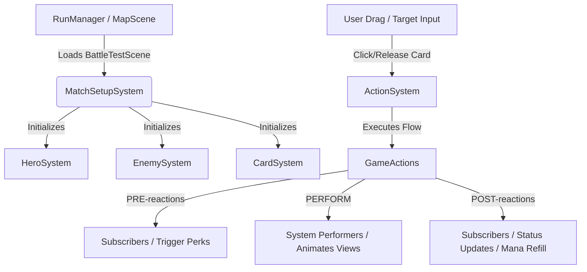

# Project-D: Developer Documentation & System Architecture

Welcome to the **Project-D** developer documentation! This README covers the architecture, existing features, guides on adding content (cards, perks, enemies, encounters, stages, and overworld interactive nodes), identified bugs, and future roadmap.

🎮 **Play the game on itch.io:** [Project-D on itch.io](https://bgdc.itch.io/project-d)

---

## Table of Contents
1. [System Architecture](#system-architecture)
2. [Action-Reaction Framework](#action-reaction-framework)
3. [Existing Features & Systems](#existing-features--systems)
4. [Guides: Adding New Content](#guides-adding-new-content)
    - [How to Make New Cards](#how-to-make-new-cards)
    - [How to Make New Perks](#how-to-make-new-perks)
    - [How to Make New Enemies & Encounters](#how-to-make-new-enemies--encounters)
    - [How to Make New Stages](#how-to-make-new-stages)
    - [How to Add Interactive Nodes (Shop & Rest Site)](#how-to-add-interactive-nodes-shop--rest-site)
5. [Identified Bugs & Errors](#identified-bugs--errors)
6. [Future Implementation & Roadmap](#future-implementation--roadmap)

---

## System Architecture

Project-D consists of two main gameplay subsystems:
1. **The Campaign Map System** (Overworld): Located in `Assets/Scripts/`, handles procedural map node generation, user path traversal, currency management, and loading combat encounters.
2. **The Battle Combat System**: Located in `Assets/Battle Assets/`, built around a decoupled **Model-View-System** paradigm driven by a custom **Action-Reaction (Command-like)** pattern.



### Decoupled Model-View-System
* **Models / Data Assets**: Contain gameplay state settings, usually initialized from Unity `ScriptableObject` configurations.
  * [Card.cs](file:///c:/Users/marco/Project-D/Assets/Battle%20Assets/Battle_scripts/Models/Card.cs), [CardData.cs](file:///c:/Users/marco/Project-D/Assets/Battle%20Assets/Battle_scripts/Data/CardData.cs)
  * [Perk.cs](file:///c:/Users/marco/Project-D/Assets/Battle%20Assets/Battle_scripts/Models/Perk.cs), [PerkCondition.cs](file:///c:/Users/marco/Project-D/Assets/Battle%20Assets/Battle_scripts/Models/PerkCondition.cs)
  * [TargetMode.cs](file:///c:/Users/marco/Project-D/Assets/Battle%20Assets/Battle_scripts/Models/TargetMode.cs), [Effect.cs](file:///c:/Users/marco/Project-D/Assets/Battle%20Assets/Battle_scripts/Models/Effect.cs)
  * [EnemyEncounter.cs](file:///c:/Users/marco/Project-D/Assets/Battle%20Assets/Battle_scripts/Data/EnemyEncounter.cs), [EncounterPoolSO.cs](file:///c:/Users/marco/Project-D/Assets/Battle%20Assets/Battle_scripts/Data/EncounterPoolSO.cs)
* **Views**: Handle visual representations, UI elements, animations, and inputs.
  * [CardView.cs](file:///c:/Users/marco/Project-D/Assets/Battle%20Assets/Battle_scripts/Views/CardView.cs), [CombatantView.cs](file:///c:/Users/marco/Project-D/Assets/Battle%20Assets/Battle_scripts/Views/CombatantView.cs), [EnemyView.cs](file:///c:/Users/marco/Project-D/Assets/Battle%20Assets/Battle_scripts/Views/EnemyView.cs), [HeroView.cs](file:///c:/Users/marco/Project-D/Assets/Battle%20Assets/Battle_scripts/Views/HeroView.cs)
  * [HPUI.cs](file:///c:/Users/marco/Project-D/Assets/Scripts/CurrencySystem/HPUI.cs), [UICard.cs](file:///c:/Users/marco/Project-D/Assets/Scripts/UI/UICard.cs), [ShopOverlayUI.cs](file:///c:/Users/marco/Project-D/Assets/Scripts/UI/ShopOverlayUI.cs), [DeckOverlayUI.cs](file:///c:/Users/marco/Project-D/Assets/Scripts/UI/DeckOverlayUI.cs)
* **Systems**: Orchestrate gameplay logic, flow execution, and persistent state.
  * [ActionSystem.cs](file:///c:/Users/marco/Project-D/Assets/Battle%20Assets/Battle_scripts/General/ActionReaction/ActionSystem.cs) (Action/Reaction pipeline)
  * [RunManager.cs](file:///c:/Users/marco/Project-D/Assets/Scripts/RunManager.cs) (Persistent run state: deck, perks, HP)
  * [CurrencyManager.cs](file:///c:/Users/marco/Project-D/Assets/Scripts/CurrencySystem/CurrencyManager.cs) (Persistent gold tracking)
  * [CardSystem.cs](file:///c:/Users/marco/Project-D/Assets/Battle%20Assets/Battle_scripts/Systems/CardSystem.cs), [ManaSystem.cs](file:///c:/Users/marco/Project-D/Assets/Battle%20Assets/Battle_scripts/Systems/ManaSystem.cs), [EnemySystem.cs](file:///c:/Users/marco/Project-D/Assets/Battle%20Assets/Battle_scripts/Systems/EnemySystem.cs), [PerkSystem.cs](file:///c:/Users/marco/Project-D/Assets/Battle%20Assets/Battle_scripts/Systems/PerkSystem.cs), [StatusEffectSystem.cs](file:///c:/Users/marco/Project-D/Assets/Battle%20Assets/Battle_scripts/Systems/StatusEffectSystem.cs), [DamageSystem.cs](file:///c:/Users/marco/Project-D/Assets/Battle%20Assets/Battle_scripts/Systems/DamageSystem.cs), [BurnSystem.cs](file:///c:/Users/marco/Project-D/Assets/Battle%20Assets/Battle_scripts/Systems/BurnSystem.cs)

---

## Action-Reaction Framework

The battle loop runs entirely through the [ActionSystem.cs](file:///c:/Users/marco/Project-D/Assets/Battle%20Assets/Battle_scripts/General/ActionReaction/ActionSystem.cs). 
A `GameAction` is a data packet carrying targets, amounts, or source information. It does not execute logic itself. Instead, it transitions through three phases:

1. **PRE Phase**:
   - Triggers all listeners registered with `ActionSystem.SubscribeReaction<T>(..., ReactionTiming.PRE)`.
   - Reactions enqueued during this phase are pushed onto the active stack of `PreReactions` to execute next.
2. **PERFORM Phase**:
   - Calls the registered **Performer** coroutine attached to that action type (e.g. subtracting mana, moving views, applying damage, showing VFX).
   - Any reactions enqueued during execution are added to `PerformReactions`.
3. **POST Phase**:
   - Triggers all listeners registered with `ActionSystem.SubscribeReaction<T>(..., ReactionTiming.POST)`.
   - Reactions enqueued during this phase are pushed onto the `PostReactions` stack.

### Nested Action execution (Sequential stack-based execution)
The system refactored its stack execution using `reactionStack` (`Stack<List<GameAction>>`). When actions yield sub-actions (like a card play causing mana spend, damage, and kills), the stack tracks the parent-child relationships and executes everything in order before returning control to the player.

### Example Flow: Player plays a card with 3 Mana Cost
```
1. PlayCardGA is created and sent to ActionSystem.
2. Performers and subscribers are fetched.
3. [PERFORM] CardSystem.PlayCardPerformer runs:
   - Removes card from hand, plays discard animations.
   - Adds SpendManaGA reaction to queue.
   - Evaluates card targets and queues PerformEffectGA.
4. SpendManaGA is executed:
   - SpendManaPerformer subtracts 3 Mana and updates ManaUI.
5. PerformEffectGA is executed:
   - Evaluates targets and executes the DealDamageGA action.
6. DealDamageGA is executed:
   - DealDamagePerformer damages the targets, plays hit VFX, checks if targets died (if so, queues KillEnemyGA).
```

---

## Existing Features & Systems

### 1. Card Management & Playing
* Players draw, discard, and play cards.
* Supports **manual target selection** (drag arrow indicator from card to enemy collider) and **automatic targeting** (hits all enemies, random targets, self, etc.).
* Implemented in [CardSystem.cs](file:///c:/Users/marco/Project-D/Assets/Battle%20Assets/Battle_scripts/Systems/CardSystem.cs) & [CardView.cs](file:///c:/Users/marco/Project-D/Assets/Battle%20Assets/Battle_scripts/Views/CardView.cs).

### 2. Mana System
* Player has a maximum mana of 3. Playing cards consumes mana. Mana is refilled at the end of the enemy turn.
* Implemented in [ManaSystem.cs](file:///c:/Users/marco/Project-D/Assets/Battle%20Assets/Battle_scripts/Systems/ManaSystem.cs).

### 3. Combatant Health & Armor
* Combatants (Hero & Enemies) have HP. Damage is absorbed by the `ARMOR` status effect first.
* Implemented in [CombatantView.cs](file:///c:/Users/marco/Project-D/Assets/Battle%20Assets/Battle_scripts/Views/CombatantView.cs).

### 4. Status Effects
* **ARMOR**: Absorbs damage stack-for-stack.
* **BURN**: Applies damage equal to current stacks at the end of the combatant's turn, then reduces the status effect by 1 stack.
* **STRENGTH**: Boosts damage dealt by card actions stack-for-stack.
* Implemented in [StatusEffectSystem.cs](file:///c:/Users/marco/Project-D/Assets/Battle%20Assets/Battle_scripts/Systems/StatusEffectSystem.cs), [BurnSystem.cs](file:///c:/Users/marco/Project-D/Assets/Battle%20Assets/Battle_scripts/Systems/BurnSystem.cs), and [DamageSystem.cs](file:///c:/Users/marco/Project-D/Assets/Battle%20Assets/Battle_scripts/Systems/DamageSystem.cs).

### 5. Perk Triggers
* Passive perks that react to actions (e.g., Blessed perk adds stats, Counterattack deals damage when the hero is attacked).
* Implemented in [PerkSystem.cs](file:///c:/Users/marco/Project-D/Assets/Battle%20Assets/Battle_scripts/Systems/PerkSystem.cs) & [Perk.cs](file:///c:/Users/marco/Project-D/Assets/Battle%20Assets/Battle_scripts/Models/Perk.cs).

### 6. Overworld Map & Persistent Progress
* **RunManager**: A persistent singleton that tracks the run's current deck list, active perks, and persistent HP across scenes.
* **CurrencyManager**: Stores gold persistently inside Unity `PlayerPrefs` under the `"PlayerGold"` key, emitting events on modifications.
* Implemented in [RunManager.cs](file:///c:/Users/marco/Project-D/Assets/Scripts/RunManager.cs) and [CurrencyManager.cs](file:///c:/Users/marco/Project-D/Assets/Scripts/CurrencySystem/CurrencyManager.cs).

---

## Guides: Adding New Content

### How to Make New Cards

Existing card effects are stored as assets under `Assets/Battle Assets/BattleData/Cards/`.

1. **Reuse or Write an Effect**:
   - If your card does damage or applies status effects, you can reuse `DealDamageEffect`, `AddStatusEffectEffect`, or `DrawCardsEffect`.
   - To create a custom effect, create a script inheriting from [Effect.cs](file:///c:/Users/marco/Project-D/Assets/Battle%20Assets/Battle_scripts/Models/Effect.cs):
     ```csharp
     public class PoisonEffect : Effect
     {
         [SerializeField] private int poisonAmount;
         public override GameAction GetGameAction(List<CombatantView> targets, CombatantView caster)
         {
             // return custom GameAction here
         }
     }
     ```
2. **Create the Card Asset**:
   - Right-click in the Project view under `Assets/Battle Assets/BattleData/Cards/` and choose **Create > Data > Card**.
   - **Description**: Describe the card (e.g. *"Deal 5 damage, apply 1 Burn"*).
   - **Mana**: Set the cost.
   - **Image**: Attach a sprite.
   - **Manual Target Effect**: Drag an effect here if the card needs manual drag-arrow targeting (e.g., target a specific enemy with a `DealDamageEffect`).
   - **Other Effects**: Add entries under this list for auto-targeted actions. Select a `TargetMode` (like `AllEnemiesTM` or `HeroTM`) and assign an `Effect`.
3. **Make the Card Obtainable**:
   - **Starting Deck**: Add the card asset to the `Deck` list inside the starting hero asset (e.g. `DefaultHero.asset`).
   - **Shop Pool**: Add the card asset to the `allCardsPool` list in the `ShopOverlayUI` component (found on the shop prefab / scene object).

---

### How to Make New Perks

Existing perks are stored in `Assets/Battle Assets/BattleData/Perks/`.

1. **Reuse or Write a Condition**:
   - Existing perk conditions are scripts inheriting from [PerkCondition.cs](file:///c:/Users/marco/Project-D/Assets/Battle%20Assets/Battle_scripts/Models/PerkCondition.cs).
   - To create a new condition, implement it like this:
     ```csharp
     public class OnManaSpentCondition : PerkCondition
     {
         public override void SubscribeCondition(Action<GameAction> reaction)
         {
             ActionSystem.SubscribeReaction<SpendManaGA>(reaction, reactionTiming);
         }
         public override void UnsubscribeCondition(Action<GameAction> reaction)
         {
             ActionSystem.UnsubscribeReaction<SpendManaGA>(reaction, reactionTiming);
         }
         public override bool SubConditionIsMet(GameAction gameAction)
         {
             return true; // or add custom filters
         }
     }
     ```
2. **Create the Perk Asset**:
   - Right-click under `Assets/Battle Assets/BattleData/Perks/` and choose **Create > Data > Perk**.
   - **Image**: Assign an icon.
   - **Perk Condition**: Select your custom or built-in perk condition and set its timing (`PRE` or `POST`).
   - **Auto Target Effect**: Setup the target mode and effect to run when triggered.
   - **Use Action Caster As Target**: If checked, redirects the effect targets to the entity that performed the triggering action (e.g., if checking an enemy attack, this targets the attacking enemy).
3. **Add to Obtainable Pools**:
   - Assign the perk asset to `allPerksPool` in the `ShopOverlayUI` component so players can purchase it in shops.

---

### How to Make New Enemies & Encounters

Project-D utilizes an encounter pool system to load random enemy configurations.

1. **Create the Enemy Asset**:
   - Right-click under `Assets/Battle Assets/BattleData/Enemies/` and choose **Create > Data > Enemy**.
   - Fill out the data:
     - **Image**: Enemy sprite sheet/art.
     - **Health**: Max health.
     - **Attack Power**: The base attack damage.
2. **Create an Encounter Asset**:
   - Right-click under `Assets/Battle Assets/BattleData/EnemyEcounters/` and choose **Create > Data > EnemyEncounter**.
   - Drag one or multiple `EnemyData` assets into the `enemies` list. This configures which group of enemies will spawn together.
3. **Register to an Encounter Pool**:
   - Select or create an `EncounterPoolSO` asset under `Assets/Battle Assets/BattleData/EcounterPool/` (**Create > Data > EncounterPool**).
   - Add your new `EnemyEncounter` to the appropriate list (`minorEnemyPool`, `eliteEnemyPool`, or `bossEnemyPool`).
   - Ensure `RunManager.Instance` references this `EncounterPoolSO` asset in the inspector. The map tracker will call `RunManager.Instance.PrepareEncounter(nodeType)` when entering battle nodes.

---

### How to Make New Stages

Stages are configured as overworld map structures via `MapConfig` assets.

1. **Create a Node Blueprint**:
   - Right-click in the project assets and select **Create > Map > NodeBlueprint**. Assign a sprite and set the `NodeType` (e.g., `MinorEnemy`, `EliteEnemy`, `RestSite`, `Store`, `Boss`).
2. **Create the Map Configuration**:
   - Right-click in the project assets and select **Create > Map > MapConfig**.
   - Configure the parameters:
     - **Node Blueprints**: Assign nodes corresponding to rest, treasure, store, boss, elite, etc.
     - **Min/Max Nodes**: Set bounds for starting and pre-boss nodes.
     - **Extra Paths**: Controls path branching densities.
     - **Layers**: Configure the layers that define map heights.

---

### How to Add Interactive Nodes (Shop & Rest Site)

New overworld map features include Rest Sites and Shops.

1. **Shops**:
   - Set a map node blueprint's NodeType to `Store`. Landing on this node loads `ShopScene`.
   - The [ShopOverlayUI.cs](file:///c:/Users/marco/Project-D/Assets/Scripts/UI/ShopOverlayUI.cs) script manages the shop overlay:
     - It randomly draws 3 cards from `allCardsPool` (cost: 50 Gold each).
     - It randomly draws 3 perks from `allPerksPool` (cost: 100 Gold each).
     - It offers a **Card Removal Service** (cost: 75 Gold) which opens [DeckOverlayUI.cs](file:///c:/Users/marco/Project-D/Assets/Scripts/UI/DeckOverlayUI.cs) in removal mode.
     - Purchasing or removing cards updates the deck in `RunManager.Instance` and deducts gold via `CurrencyManager.Instance`.
2. **Rest Sites**:
   - Set a node blueprint's NodeType to `RestSite`.
   - Rest site interactive environments contain a GameObject with [RestSite.cs](file:///c:/Users/marco/Project-D/Assets/Scripts/Interaction/RestSite.cs).
   - Configure `Health Refill Percentage` (default is `0.20` or 20%). When interacted with, it calculates the healing value based on `RunManager.Instance.HeroMaxHP` and updates `RunManager.Instance.HeroCurrentHP`, clamping it to max health.

---

## Identified Bugs & Errors

These are major structural issues identified in the codebase that require resolution:

---

## Future Implementation & Roadmap

1. **Polishing Scene Transitions**: Better visual fade-in/fade-out during map-to-battle and map-to-shop transitions.
2. **Dynamic Loot Rewards**: Choosing a card to add to the deck from a selection of 3 random cards as a post-battle reward.
3. **Advanced Perk Types**: Interactive and consumable perks (Relics) that provide active abilities during battle.
4. **Enemy AI Expansion**: More complex enemy intent behaviors (shielding, debuffing player mana, summoning allies).
